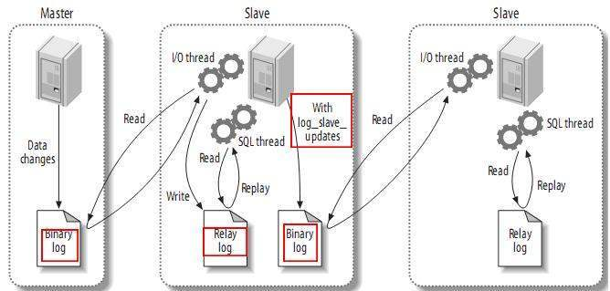
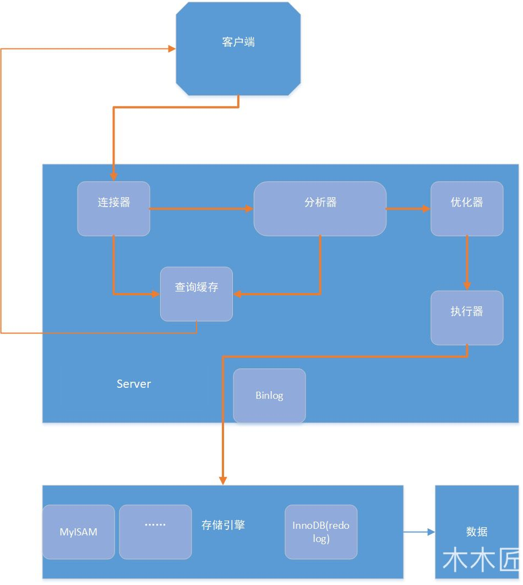

### mysql事务的性质

#### 原子性

> 事务被视为不可分割的最小单元，事务的所有操作要么全部提交成功，要么全部失败回滚。
>
> 回滚可以用回滚日志来实现，回滚日志记录着事务所执行的修改操作，在回滚时反向执行这些修改操作即可

#### 一致性

> 数据库在事务执行前后都保持一致性状态。在一致性状态下，所有事务对一个数据的读取结果都是相同的。

#### 隔离性

> 一个事务所做的修改在最终提交以前，对其它事务是不可见的。

#### 事务性

> 一旦事务提交，则其所做的修改将会永远保存到数据库中。即使系统发生崩溃，事务执行的结果也不能丢失。
>
> 使用重做日志来保证持久性。

### mysql索引失效的情况

1. 如果条件中有or，即使其中有条件带索引也不会使用(这也是为什么尽量少用or的原因)
2. 对于多列索引，不是使用的第一部分(第一个)，则不会使用索引（最左匹配）
3. like查询是以%开头
4. 如果列类型是字符串，那一定要在条件中将数据使用引号引用起来,否则不使用索引
5. 如果mysql估计使用全表扫描要比使用索引快,则不使用索引

### Mysql怎么解决脏读，怎么解决幻读

1. 脏读将隔离级别设置为提交读，就可以解决脏读了
2. 使用 MVCC + Next-Key Locks 可以解决幻读问题

### mysql发生死锁的情况

一个sql语句在修改一条记录的时间，会加上排他锁，多个事务同时执行两条互相相反的修改语句，便会造成死锁；

### mysql分区分表

1. 分表:垂直分表（分列）和水平分表（将历史数据）
2. 分区

### mysql主从复制

https://segmentfault.com/a/1190000008942618

> 在MySQL主从复制架构中，读操作可以在所有的服务器上面进行，而写操作只能在主服务器上面进行。主从复制架构虽然给读操作提供了扩展，可如果写操作也比较多的话（多台从服务器还要从主服务器上面同步数据），单主模型的复制中主服务器势必会成为性能瓶颈。

1. 基于记录的复制：主服务器上面执行的语句在从服务器上面再执行一遍，在MySQL-3.23版本以后支持。

   存在的问题：时间上可能不完全同步造成偏差，执行语句的用户也可能是不同一个用户

2. 基于语句的复制：把主服务器上面改编后的内容直接复制过去，而不关心到底改变该内容是由哪条语句引发的，在MySQL-5.0版本以后引入。

   存在的问题：比如一个工资表中有一万个用户，我们把每个用户的工资+1000，那么基于行的复制则要复制一万行的内容，由此造成的开销比较大，而基于语句的复制仅仅一条语句就可以了。
   

#### 复制过程
1. 在每个事务更新数据完成之前，master在二进制日志记录这些改变。写入二进制日志完成后，master通知存储引擎提交事务。
2.Slave将master的binary log复制到其中继日志。首先slave开始一个工作线程（I/O），I/O线程在master上打开一个普通的连接，然后开始binlog dump process。binlog dump process从master的二进制日志中读取事件，如果已经跟上master，它会睡眠并等待master产生新的事件，I/O线程将这些事件写入中继日志。
3.Sql slave thread（sql从线程）处理该过程的最后一步，sql线程从中继日志读取事件，并重放其中的事件而更新slave数据，使其与master中的数据一致，只要该线程与I/O线程保持一致，中继日志通常会位于os缓存中，所以中继日志的开销很小。

### 事务隔离级别，4个隔离级别分别有什么并发问题？

| 隔离级别   | 解决问题                                                     | 锁的级别                                                     |
| ---------- | ------------------------------------------------------------ | ------------------------------------------------------------ |
| 未提交读RU | 解决了更新丢失问题，却会出现脏读                             |                                                              |
| 提交读RC   | 别避免了脏读，但是却可能出现不可重复读                       | 读取不加锁，更删改加行锁,where 条件过滤之后，不符合条件的记录上的行锁，会释放掉 |
| 可重复读RR | 避免了不可重复读取和脏读，但是有时可能出现幻读，mysql的默认级别 |                                                              |
| 可序列化   | 在该级别下，事务顺序执行，不仅可以避免脏读、不可重复读，还避免了幻像读。 | 可串行化隔离级别时，在这个事务没有被提交之前；其他的线程，只能等到当前操作完成之后，才能进行操作，这样会非常耗时， |

### 存储引擎Innodb和Myisam的区别以及使用场景

|          | Innodb                                                       | Myisam                                                       |
| -------- | ------------------------------------------------------------ | ------------------------------------------------------------ |
| 优点     | 支持事务处理；实现了SQL标准的四种隔离级别；支持行级锁和外键约束；可以利用事务日志进行恢复(binlog)； | 高性能读取；有专门保存表的行数的位置；不用扫描全表           |
| 缺点     | 不支持FULLTEXT类型的索引，因为它没有保存表的行数，当使用COUNT统计时会扫描全表 | 不支持数据库事务，行锁和外键，insert和upate会进行表锁，不支持事务； |
| 使用场景 | 需要事务操作，更新数据需要行级锁；大数据量写，大型互联网应用； | 频繁的统计计算，适合从数据库                                 |
| 区别     |                                                              |                                                              |

### mysql索引

#### 聚簇索引、非聚簇索引

|            | 区别                                                         |
| ---------- | ------------------------------------------------------------ |
| 聚簇索引   | 数据按索引顺序存储，中子结点存储真实的物理数据；Innodb，物理文件只有两个文件； |
| 非聚簇索引 | 存储指向真正数据行的指针；Myisam，物理文件有三个文件，一个存储表结构，一个存储索引，一个存储数据 |

#### 创建索引的方式

1. create unique index indexName on table(username(length))
2. alter table mytable add unique [indexname] (username(length))
3. 创建表的时间指定

####  为什么主键用auto_increment

> 关键不在于自动，而是在于增加，由于mysql使用的b+树作为索引，查询，所有的叶节点之间有指针相连接，使用按照一定顺序的增加的索引能够很快的判断数据的位置；

https://xlzd.me/2018/09/14/why-mysql-innodb-need-auto-increment-primary-key/

#### 如何生成UUID，以及UUID的缺点

```java
UUID uuid = UUID.randomUUID();
System.out.println(uuid);
String dxmbid = uuid.toString().replace("-", "");		System.out.println(dxmbid);
System.out.println(dxmbid.length());
```

缺点:

1. 占空间太大
2. 索引效率低
3. UUID是唯一随机的，不适合人读
4. 无法排序

#### 查询主键/非主键索引的实现方式

基于非主键索引的查询**需要多扫描一棵索引树,因此，我们在应用中应该尽量使用主键查询**。

#### 回表查询和覆盖索引

https://www.cnblogs.com/myseries/p/11265849.html

> 如果使用普通索引，则查询时间先查找到主键值，之后再通过主键值查找到自己想要的数据；需要扫码两遍所引树；这就是回表查询；


索引覆盖

> 只需要在一棵索引树上就能获取SQL所需的所有列数据，无需回表;
>
> 最常用的方式是使用联合索引；

#### 联合索引B+树上的机构，-最左匹配

https://blog.csdn.net/weixin_30531261/article/details/79329722


> 联合索引(年龄, 姓氏,名字)，叶节点上data域存储的是三个关键字的数据;非叶子节点是存储的年龄的索引；
>
> ``select * from STUDENT where 姓氏='李' and 名字='安'``、``where 名字='安'``是无法使用联合索引的；而
>
> ``where 年龄=1 and 姓氏='李'``、``where 年龄=1 and 姓氏='黄' and 名字='安'``是可以使用联合索引的；
>
> 

#### 聚集索引和普通索引

> InnoDB**聚集索引**的叶子节点存储行记录，因此， InnoDB必须要有，且只有一个聚集索引
>
> InnoDB**普通索引**的叶子节点存储主键值。

### 7. mysql锁

#### 排他锁-X锁-写锁

使用时间一点要获取IX锁，且不能再加其他锁

#### 共享锁-S锁-读锁

使用时间一点要获取IS锁或者IX锁，可以和其他S锁共享；

#### 意向锁

> 不是真正的锁

##### IX锁

##### IS锁

#### record locks

> 锁定一个记录上的索引，而不是记录本身。
>
> 如果表没有设置索引，InnoDB 会自动在主键上创建隐藏的聚簇索引，因此 Record Locks 依然可以使用

#### gap locks

> 锁定索引之间的间隙，但是不包含索引本身。例如当一个事务执行以下语句，其它事务就不能在 t.c 中插入 15。

```sql
SELECT c FROM t WHERE c BETWEEN 10 and 20 FOR UPDATE;
```

#### Next-Key Locks

它是 Record Locks 和 Gap Locks 的结合，不仅锁定一个记录上的索引，也锁定索引之间的间隙。例如一个索引包含以下值：10, 11, 13, and 20，那么就需要锁定以下区间：

```sql
(-∞, 10]
(10, 11]
(11, 13]
(13, 20]
(20, +∞)
```

#### 乐观锁和悲观锁

##### 乐观锁

> 每次去拿数据的时候都认为别人不会修改，所以不会上锁，但是在提交更新的时候会判断一下在此期间别人有没有去更新这个数据。乐观锁适用于读多写少的应用场景，这样可以提高吞吐量。

实现方式:

1. 使用数据版本（Version）记录机制实现，这是乐观锁最常用的一种实现方式。何谓数据版本？即为数据增加一个版本标识，一般是通过为数据库表增加一个数字类型的 “version” 字段来实现。当读取数据时，将version字段的值一同读出，数据每更新一次，对此version值加一。当我们提交更新的时候，判断数据库表对应记录的当前版本信息与第一次取出来的version值进行比对，如果数据库表当前版本号与第一次取出来的version值相等，则予以更新，否则认为是过期数据。
2. 使用时间戳（timestamp）。乐观锁定的第二种实现方式和第一种差不多，同样是在需要乐观锁控制的table中增加一个字段，名称无所谓，字段类型使用时间戳（timestamp）, 和上面的version类似，也是在更新提交的时候检查当前数据库中数据的时间戳和自己更新前取到的时间戳进行对比，如果一致则OK，否则就是版本冲突。

> 每次去拿数据的时候都认为别人会修改，所以每次在拿数据的时候都会上锁，这样别人想拿这个数据就会阻塞直到它拿到锁。

### MVCC

https://draveness.me/database-concurrency-control

### 数据库调优

https://www.jianshu.com/p/55020afb5eba

#### 数据库优化四个维度

> 数据库优化**维度**有四个:
> **硬件**、**系统配置**、**数据库表结构**、**SQL及索引**
> 优化**成本**:
> **硬件**>**系统配置**>**数据库表结构**>**SQL及索引**
> 优化**效果**:
> **硬件**<**系统配置**<**数据库表结构**<**SQL及索引**

#### msyql慢查询分析

```sql
show variables like 'slow%'; 
+---------------------+----------------------------------------------------------+
| Variable_name       | Value                                                    |
+---------------------+----------------------------------------------------------+
| slow_launch_time    | 2                                                        |
| slow_query_log      | OFF                                                      |
| slow_query_log_file | D:\code_envir\mysql-8.0.19-winx64\Data\hearecho-slow.log |
+---------------------+----------------------------------------------------------+
slow_launch_time  查询时间阈值不超过2s
slow_query_log：查询记录是否打开
slow_query_log_file：查询记录位置
```

#### 分库分表

### sql优化/如何使用索引避免全表扫描？

1. 应尽量避免在**where** 子句中对字段进行null 值判断

```sql
select id from t where num is null
建议将null设置为0
```

2. 应尽量避免在**where** 子句中使用!=或<>操作符
3. 应尽量避免在**where** 子句中使用**or** 来连接条件
4. **in** 和**not** **in** 也要慎用能用**between**就用**between**
5. 通配符最好不要放在第一位

```sql
select id from t where name like '%abc%'
不建议
```

6. 如果在**where** 子句中使用参数，也会导致全表扫描。因为**SQL**只有在运行时才会解析局部变量，但优化程序不能将访问计划的选择推 迟到运行时；它必须在编译时进行选择。
7. 应尽量避免在**where** 子句中对字段进行表达式操作
8. 应尽量避免在**where**子句中对字段进行函数操作
9. 在使用索引字段作为条件时，如果该索引是复合索引，那么必须使用到该索引中的第一个字段作为条件时才能保证系统使用该索引，否则该索引将不会被使用，并且应尽可能的让字段顺序与索引顺序相一致。
10. 很多时候用**exists** 代替**in** 是一个好的选择

```sql
select num from a where exists(select 1 from b where num=a.num)
```

### Explain各个字段的含义

> explain + select语句

| 字段名        | 含义                                                         |
| ------------- | ------------------------------------------------------------ |
| id            | SELECT识别符。这是SELECT查询序列号。这个不重要,查询序号即为sql语句执行的顺序 |
| select_type   | select的类型: simple：简单select语句、primay：最外面的select,在有子查询的语句中，最外面的select查询就是primary,上图中就是这样、union：union union语句的第二个或者说是后面那一个.现执行一条语句、dependent union：UNION中的第二个或后面的SELECT语句，取决于外面的查询、union result：union的结果 |
| table         | 输出的行所用的表                                             |
| type          | system、const、eq_ref、ref。。。。                           |
| possible_keys | 提示使用哪个索引会在该表中找到行                             |
| keys          | MYSQL使用的索引，                                            |
| key_len       | MYSQL使用的索引长度                                          |
| ref           | ref列显示使用哪个列或常数与key一起从表中选择行               |
| rows          | 显示MYSQL执行查询的行数,数值越大越不好，说明没有用好索引     |
| extra         | 该列包含MySQL解决查询的详细信息。                            |

### mysql主从复制

https://segmentfault.com/a/1190000008942618

1. Slave上面的IO进程连接上Master，并请求从指定日志文件的指定位置（或者从最开始的日志）之后的日志内容。
2. Master接收到来自Slave的IO进程的请求后，负责复制的IO进程会根据请求信息读取日志指定位置之后的日志信息，返回给Slave的IO进程。返回信息中除了日志所包含的信息之外，还包括本次返回的信息已经到Master端的bin-log文件的名称以及bin-log的位置。
3. Slave的IO进程接收到信息后，将接收到的日志内容依次添加到Slave端的relay-log文件的最末端，并将读取到的Master端的 bin-log的文件名和位置记录到master-info文件中，以便在下一次读取的时候能够清楚的告诉Master“我需要从某个bin-log的哪个位置开始往后的日志内容，请发给我”。
4. Slave的Sql进程检测到relay-log中新增加了内容后，会马上解析relay-log的内容成为在Master端真实执行时候的那些可执行的内容，并在自身执行。



1. sql语句复制
2. 记录复制
3. 混合复制

同步复制、异步复制

一、异步复制（Asynchronous replication）
1、逻辑上

MySQL默认的复制即是异步的，主库在执行完客户端提交的事务后会立即将结果返给给客户端，并不关心从库是否已经接收并处理，这样就会有一个问题，主如果crash掉了，此时主上已经提交的事务可能并没有传到从库上，如果此时，强行将从提升为主，可能导致新主上的数据不完整。

2、技术上

主库将事务 Binlog 事件写入到 Binlog 文件中，此时主库只会通知一下 Dump 线程发送这些新的 Binlog，然后主库就会继续处理提交操作，而此时不会保证这些 Binlog 传到任何一个从库节点上。

二、全同步复制（Fully synchronous replication）

1、逻辑上

指当主库执行完一个事务，所有的从库都执行了该事务才返回给客户端。因为需要等待所有从库执行完该事务才能返回，所以全同步复制的性能必然会收到严重的影响。

2、技术上

当主库提交事务之后，所有的从库节点必须收到、APPLY并且提交这些事务，然后主库线程才能继续做后续操作。但缺点是，主库完成一个事务的时间会被拉长，性能降低。

三、半同步复制（Semisynchronous replication）

1、逻辑上

是介于全同步复制与全异步复制之间的一种，主库只需要等待至少一个从库节点收到并且 Flush Binlog 到 Relay Log 文件即可，主库不需要等待所有从库给主库反馈。同时，这里只是一个收到的反馈，而不是已经完全完成并且提交的反馈，如此，节省了很多时间。

2、技术上

介于异步复制和全同步复制之间，主库在执行完客户端提交的事务后不是立刻返回给客户端，而是等待至少一个从库接收到并写到relay log中才返回给客户端。相对于异步复制，半同步复制提高了数据的安全性，同时它也造成了一定程度的延迟，这个延迟最少是一个TCP/IP往返的时间。所以，半同步复制最好在低延时的网络中使用。

### 主从复制或读写分离等数据不一致性问题以及如何解决

https://blog.csdn.net/weixin_43885417/article/details/101676610

1. 同步复制
2. 利用中间件，进行分发，将复制期间的读路由路由到主数据库；
3. 利用缓存，缓存过期时间为复制时间

### B树索引为什么使用B+树，相对于B树有什么优点？为什么不能红黑树？

为什么使用b+树

> 索引查找过程中就要产生磁盘I/O消耗,主要看IO次数，和磁盘存取原理有关。 根据B-Tree的定义，可知检索一次最多需要访问h个节点。数据库系统的设计者巧妙利用了磁盘预读原理， 将一个节点的大小设为等于一个页，这样每个节点只需要一次I/O就可以完全载入 局部性原理与磁盘预读

为什么不适用b树

> 1. B+树只有叶节点存放数据，其余节点用来索引，而B-树是每个索引节点都会有Data域。
> 2.  B+树所有的Data域在叶子节点，并且所有叶子节点之间都有一个链指针。 这样遍历叶子节点就能获得全部数据，这样就能进行区间访问啦。在数据库中基于范围的查询是非常频繁的，而B树不支持这样的遍历操作。

为什么不用哈希表，为什么不用红黑树

> 1. 哈希表只适用与查找等值查询，如果是返回查询的话哈希表的速度将会特别慢
> 2. 黑树往往出现由于树的深度过大而造成磁盘IO读写过于频繁，进而导致效率低下的情况。

### mysql语句的执行过程



查询语句的执行流程如下：权限校验（如果命中缓存）---》查询缓存---》分析器---》优化器---》权限校验---》执行器---》引擎

更新语句执行流程如下：分析器----》权限校验----》执行器---》引擎---redo log(prepare 状态---》binlog---》redo log(commit状态)

### sql语句

left join

> 左外连接，将左表中的全部行取出，无论是否匹配

where

> 对行的检索限制条件，后面可以用between表示介于，> < ，or，and

group by

> 按照 关键字分组

having

> 对分组进行限制

limit

> 取出结果前几行；

order by

> 排序


