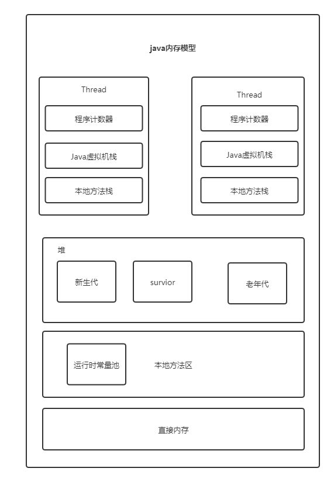

# java基础知识

### 阻塞队列

几种常用的阻塞队列

- ArrayBlockingQueue ：一个由数组结构组成的有界阻塞队列。
- LinkedBlockingQueue ：一个由链表结构组成的有界阻塞队列。
- PriorityBlockingQueue ：一个支持优先级排序的无界阻塞队列。
- DelayQueue：一个使用优先级队列实现的无界阻塞队列。
- SynchronousQueue：一个不存储元素的阻塞队列。
- LinkedTransferQueue：一个由链表结构组成的无界阻塞队列。
- LinkedBlockingDeque：一个由链表结构组成的双向阻塞队列。

### Java程序启动至少启动几个线程

2个或者五个

### 抽象类和接口区别，以及各自的使用场景

1、相同点
     A. 两者都是抽象类，都不能实例化。
     B. interface实现类及abstrct class的子类都必须要实现已经声明的抽象方法。

2.、不同点
     A. interface需要实现，要用implements，而abstract class需要继承，要用extends。
     B. 一个类可以实现多个interface，但一个类只能继承一个abstract class。
     C. interface强调特定功能的实现，而abstract class强调所属关系。 
    D. 尽管interface实现类及abstrct class的子类都必须要实现相应的抽象方法，但实现的形式不同。interface中的每一个方法都是抽象方法，都只是声明的(declaration, 没有方法体)，实现类必须要实现。而abstract class的子类可以有选择地实现。
     这个选择有两点含义：
            一是Abastract class中并非所有的方法都是抽象的，只有那些冠有abstract的方法才是抽象的，子类必须实现。那些没有abstract的方法，在Abstrct class中必须定义方法体。
            二是abstract class的子类在继承它时，对非抽象方法既可以直接继承，也可以覆盖；而对抽象方法，可以选择实现，也可以通过再次声明其方法为抽象的方式，无需实现，留给其子类来实现，但此类必须也声明为抽象类。既是抽象类，当然也不能实例化。
    E. abstract class是interface与Class的中介。
         interface是完全抽象的，只能声明方法，而且只能声明pulic的方法，不能声明private及protected的方法，不能定义方法体，也不能声明实例变量。然而，interface却可以声明常量变量，并且在JDK中不难找出这种例子。但将常量变量放在interface中违背了其作为接口的作用而存在的宗旨，也混淆了interface与类的不同价值。如果的确需要，可以将其放在相应的abstract class或Class中。
       abstract class在interface及Class中起到了承上启下的作用。一方面，abstract class是抽象的，可以声明抽象方法，以规范子类必须实现的功能；另一方面，它又可以定义缺省的方法体，供子类直接使用或覆盖。另外，它还可以定义自己的实例变量，以供子类通过继承来使用。

3、interface的应用场合
     A. 类与类之前需要特定的接口进行协调，而不在乎其如何实现。
     B. 作为能够实现特定功能的标识存在，也可以是什么接口方法都没有的纯粹标识。
     C. 需要将一组类视为单一的类，而调用者只通过接口来与这组类发生联系。
     D. 需要实现特定的多项功能，而这些功能之间可能完全没有任何联系。

4、abstract class的应用场合
      一句话，在既需要统一的接口，又需要实例变量或缺省的方法的情况下，就可以使用它。最常见的有：
      A. 定义了一组接口，但又不想强迫每个实现类都必须实现所有的接口。可以用abstract class定义一组方法体，甚至可以是空方法体，然后由子类选择自己所感兴趣的方法来覆盖。
      B. 某些场合下，只靠纯粹的接口不能满足类与类之间的协调，还必需类中表示状态的变量来区别不同的关系。abstract的中介作用可以很好地满足这一点。
      C. 规范了一组相互协调的方法，其中一些方法是共同的，与状态无关的，可以共享的，无需子类分别实现；而另一些方法却需要各个子类根据自己特定的状态来实现特定的功能

### 反射使用场景

1. 临时创建一个类
2. 访问一个类的私有属性

### ThreadLocal

#### 作用

> ThreadLocal是每个线程独有的，所以不是用来共享的，ThreadLocal 适用于每个线程需要自己独立的实例且该实例需要在多个方法中被使用，也即变量在线程间隔离而在方法或类间共享的场景

### List删除元素，fast-fail fast-safe

https://blog.csdn.net/ch717828/article/details/46892051

### List删除元素

> 使用iterator.remove()方法，不能使用list.remove(),不然会报错；ConcurrentModificationException异常。

```java
List<Integer>  list = new ArrayList<>();
//        List<Integer> linked = new LinkedList<>();
for (int i = 0; i <5 ; i++) {
    list.add(i);
}
Iterator<Integer> iterator= list.iterator();
while (iterator.hasNext()) {
    int i = iterator.next();
    if (i==3){
        iterator.remove();
    }
    System.out.println(i);
}
for (int i:list) {
    System.out.println(i);
}
```

### 泛型以及泛型擦除。List<A>类型的list,可以加入无继承关系的B类型对象吗？如何加入？

### 反序列化失败的场景

1. 没有加serialVersionUID，之后类的字段发生了改变，那么反序列化便会失败；
2. 写入文件之后（持久化）之后，类的名称发生了改变，则发序列化失败；

# java容器

https://blog.csdn.net/xzp_12345/article/details/79251174

### hashmap

1. 阈值 为 大小 * 0.75
2. 大于阈值之后变进行扩容

### HashMap为什么不是线程安全的？

> hashmap 在添加Entry的时间，多线程操作可能会导致线程不安全；

### hashtable，hashmap，concurenthashmap的区别

### concurenthashmap jdk1.8改动

1. 利用CAS+synchronized来保证并发更新的安全，底层依然采用数组+链表+红黑树的存储结构。

2. basecount 记录元素数量，通过CAS更新

3. countercells 记录元素变化个数，cas操作basecount失败时使用。

4. 扩容的元素复制可并行进行。

# Java并发

### sleep 和 wait的区别

> sleep：
>
> - 让当前线程休眠指定时间
>
> - 不释放锁资源
>
> - 可通过调用interrupt()方法来唤醒休眠线程
>
> wait：
>
> - 让当前线程进入等待状态，当其他线程调用notify或者notifyAll方法时，当前线程进入就绪状态
>
> - 当前线程会释放已获取的锁资源，并进入等待队列

### 多线程三个特性

#### 原子性

操作不可分割，可以使用synchronized关键字，和lock锁可以实现操作的原子性，另外AtomicInteger也具有原子性

#### 可见性

一个线程对于共享变量的操作对其他线程是可见的，可以使用volatile 关键字定义变量；

#### 顺序性

防止java代码优化重拍，volatile 关键字定义变量可以实现；

### 线程池

##### 关键参数：

| 参数名称      | 作用                                               | 设置依据                                                     |
| ------------- | -------------------------------------------------- | ------------------------------------------------------------ |
| corePoolSzie  | 线程池核心线程数量                                 | 大多设置为核心数加一；IO密集型=2Ncpu；计算密集型=Ncpu        |
| mixPoolSize   | 线程池最大线程数量                                 |                                                              |
| taskQueue     | 储存任务队列（同步）                               | 表示如果任务数量超过核心池大小，多余的任务添加到阻塞队列中   |
| keepAliveTime | 非核心线程存活时间                                 |                                                              |
| threadFactory | 生成线程的工厂类                                   |                                                              |
| handler       | 任务队列满与线程数达到最大数量时间，执行的拒绝策略 | 直接丢弃（DiscardPolicy）丢弃队列中最老的任务(DiscardOldestPolicy)。抛异常(AbortPolicy)将任务分给调用线程来执行(CallerRunsPolicy)。 |
| unit          | 线程池维护线程所允许的空闲时间的单位               |                                                              |

##### 自带的线程池

1. newFixedThreadPool(固定大小的线程池)
2. newSingleThreadExecutor(单线程的线程池)
3. newScheduledThreadPool(线程池中的线程可以定时执行一些任务)
4. newCachedThreadPool(可缓存的线程池)，如果线程池的大小超过了处理任务所需要的线程，那么就会回收部分空闲（60秒不执行任务）的线程，当任务数增加时，此线程池又可以智能的添加新线程来处理任务。此线程池不会对线程池大小做限制，线程池大小完全依赖于操作系统（或者说JVM）能够创建的最大线程大小。

### volatile关键字

##### 实现原理

- read、load、use动作必须**连续出现**。
- assign、store、write动作必须**连续出现**

所以volatile变量能够保证读取前必须先从主内存刷新最新的值，写入后必须立即同步回主内存；

### synchronized 和 lock

> 二者的区别:
>
> 1. synchronized 是Java内置关键字，Lock是Java类
>
> 2. synchronized 无法显式的判断是否获取锁的状态，Lock可以判断是否获取到锁
>
> 3. synchronized 会自动释放锁，Lock需要在finally中手工释放锁
>
> 4. synchronized 不同线程获取锁只有一个线程能获取成功，其他线程会一直阻塞直到获取锁，Lock有阻塞锁，也有非阻塞锁，阻塞锁还有尝试设置，功能更强
>
> 5. synchronized 可重入，不可中断，非公平，Lock锁可重入，可判断，有公平锁，非公平锁
>
> 6. Lock锁适合大量同步代码的同步问题，synchronized锁适合代码少量的同步问题

#### synchronized(jvm实现)

> Synchronized可以修饰普通方法、同步方法块、静态方法；(可重入)
>  普通方法锁是当前实例对象，静态方法锁是当前类的Class对象，同步方法块锁是Synchonized配置的对象；
>  用的锁是存在对象头里的,根据mark word的锁状态来判断锁，如果锁只被同一个线程持有使用的是偏向锁，不同线程互相交替持有锁使用轻量级锁，多线程竞争使用重量级锁。锁会按偏向锁->轻量级锁->重量级锁 升级，称为锁膨胀

##### 可重入的实现

> 为synchronized使用的是锁对象，当某个线程第一次持有锁后，会修改锁对象的mark word锁状态为偏向锁，偏向锁锁会在当前线程的栈帧中建立一个锁记录空间，mark word会将指针指向栈中的锁记录。当线程再次获取锁对象的时候，会检查mark word 中的指针是否指向当前线程的栈帧，如果是就直接获取锁，如果不是就需要竞争;偏向锁可能就会进化为重量级锁

#### lock

> lock是一个接口类，实现主要有ReentrantLock可重入锁，ReadLock读锁，WriteLock写锁等；主要创建方式是通过多态的方式进行的创建；

##### ReentrantLock(jdk实现)

> 底层是通过AQS实现的，每次获取锁，均会通过CAS使得state加一，而2其他线程想要获取锁的时候，只能等待这个state加一才能通过AQS队列获取这个锁；最常用的锁
>
> 能够使用重入锁的的必须保证

###### ReentrantLock中的lock和unlock之间的同步如何进行线程间的通信

> 际就是使用synchronized关键字同步中用到的wait和notify,notifyAll方法的类似功能。ReentrantLock采用的是Condition接口中的await等待，signal方法进行唤醒。Condition这个接口的类型是通过ReentrantLock的实例newCondition()进行创建的类型;

### 公平锁和非公平锁的实现

https://blog.csdn.net/qyp199312/article/details/70598480

### ThreadLocal原理，如何使用？

### wait,notify的过程

> 一定要获取锁，所以必须出现在同步代码块中

#### lock中的使用

> wait()，notify()及notifyAll()只能在synchronized语句中使用，但是如果使用的是ReenTrantLock实现同步，该如何达到这三个方法的效果呢？解决方法是使用ReenTrantLock.newCondition()获取一个Condition类对象，然后Condition的await()，signal()以及signalAll()分别对应上面的三个方法

# java虚拟机

### java内存模型

#### 运行时数据区域



### java内存管理

#### Mirror GC 和 FULL GC

1. mirror gc  新生代空间不足就会发生一次，速度快，回收新生代
2. full gc：回收老年代和新生代，老年代对象其存活时间长，因此 Full GC 很少执行，执行速度会比 Minor GC 慢很多。

#### 内存分配策略

1. 对象优先进入新生代
2. 大对象直接进入老年代
3. 长期存活的对象进入老年代，经过Mirror GC还存活的对象年龄加一，动态对象年龄判定
4. 空间分配担保

#### FULL GC的触发条件

1. System.gc()调用
2. 空间担保失败
3. 老年代空间不足

### GC

#### 垃圾收集器

1. Serial收集器
2. ParNew收集器
3. Parallel Scavenge 收集器
4. Serial Old收集器
5. Parallel Old收集器
6. CMS收集器

过程:

- 初始标记：仅仅只是标记一下 GC Roots 能直接关联到的对象，速度很快，需要停顿。
- 并发标记：进行 GC Roots Tracing 的过程，它在整个回收过程中耗时最长，不需要停顿。
- 重新标记：为了修正并发标记期间因用户程序继续运作而导致标记产生变动的那一部分对象的标记记录，需要停顿。
- 并发清除：不需要停顿。

缺点:

- 吞吐量低：低停顿时间是以牺牲吞吐量为代价的，导致 CPU 利用率不够高。
- 无法处理浮动垃圾，可能出现 Concurrent Mode Failure。浮动垃圾是指并发清除阶段由于用户线程继续运行而产生的垃圾，这部分垃圾只能到下一次 GC 时才能进行回收。由于浮动垃圾的存在，因此需要预留出一部分内存，意味着 CMS 收集不能像其它收集器那样等待老年代快满的时候再回收。如果预留的内存不够存放浮动垃圾，就会出现 Concurrent Mode Failure，这时虚拟机将临时启用 Serial Old 来替代 CMS。
- 标记 - 清除算法导致的空间碎片，往往出现老年代空间剩余，但无法找到足够大连续空间来分配当前对象，不得不提前触发一次 Full GC。

7. G1收集器

过程

- 初始标记
- 并发标记
- 最终标记：为了修正在并发标记期间因用户程序继续运作而导致标记产生变动的那一部分标记记录，虚拟机将这段时间对象变化记录在线程的 Remembered Set Logs 里面，最终标记阶段需要把 Remembered Set Logs 的数据合并到 Remembered Set 中。这阶段需要停顿线程，但是可并行执行。
- 筛选回收：首先对各个 Region 中的回收价值和成本进行排序，根据用户所期望的 GC 停顿时间来制定回收计划。此阶段其实也可以做到与用户程序一起并发执行，但是因为只回收一部分 Region，时间是用户可控制的，而且停顿用户线程将大幅度提高收集效率。

#### 垃圾收集方法

1. 标记-清除

> 将可以收集的对象进行标记，之后回收即可，速度快，但是会遗留很多内存碎片，导致无法分配大对象；

2. 标记-整理

> 将可以手机的对象进行标记，回收之后，将未收集对象进行整理，速度慢，但是不会有碎片；

3. 复制

> 将内存划分为大小相等的两块，每次只使用其中一块，当这一块内存用完了就将还存活的对象复制到另一块上面，然后再把使用过的内存空间进行一次清理。
>
> 在的商业虚拟机都采用这种收集算法回收新生代，但是并不是划分为大小相等的两块，而是一块较大的 Eden 空间和两块较小的 Survivor 空间，每次使用 Eden 和其中一块 Survivor。在回收时，将 Eden 和 Survivor 中还存活着的对象全部复制到另一块 Survivor 上，最后清理 Eden 和使用过的那一块 Survivor

4. 分代收集

> 新生代使用：复制算法
>
> 老年代使用：标记 - 清除 或者 标记 - 整理 算法

### java内存泄露以及内存溢出

##### 内存泄漏：

> java分配一个对象之后，这个对象丢失，没有被回收，这就造成了内存泄漏，内存泄漏最后便会造成内存溢出；

###### 分类

1. 常发性内存泄漏。发生内存泄漏的代码会被多次执行到，每次被执行的时候都会导致一块内存泄漏。 

2. 偶发性内存泄漏。发生内存泄漏的代码只有在某些特定环境或操作过程下才会发生。常发性和偶发性是相对的。对于特定的环境，偶发性的也许就变成了常发性的。所以测试环境和测试方法对检测内存泄漏至关重要。 

3. 一次性内存泄漏。发生内存泄漏的代码只会被执行一次，或者由于算法上的缺陷，导致总会有一块仅且一块内存发生泄漏。比如，在类的构造函数中分配内存，在析构函数中却没有释放该内存，所以内存泄漏只会发生一次。 

4. 隐式内存泄漏。程序在运行过程中不停的分配内存，但是直到结束的时候才释放内存。严格的说这里并没有发生内存泄漏，因为最终程序释放了所有申请的内存。但是对于一个服务器程序，需要运行几天，几周甚至几个月，不及时释放内存也可能导致最终耗尽系统的所有内存。所以，我们称这类内存泄漏为隐式内存泄漏。 

###### 内存泄漏检查命令

1. jstat

##### 内存溢出(out of memory)：

> 指程序在申请内存时，没有足够的内存空间供其使用，出现out of memory

###### 引发原因

1. 内存中加载的数据量过于庞大，如一次从数据库取出过多数据；

2. 集合类中有对对象的引用，使用完后未清空，使得JVM不能回收；

3. 代码中存在死循环或循环产生过多重复的对象实体；

4. 使用的第三方软件中的BUG；

5. 启动参数内存值设定的过小


### java内存读写

lock：作用于主内存，把变量标识为线程独占状态。

unlock：作用于主内存，解除独占状态。

read：作用主内存，把一个变量的值从主内存传输到线程的工作内存。

load：作用于工作内存，把read操作传过来的变量值放入工作内存的变量副本中。

use：作用工作内存，把工作内存当中的一个变量值传给执行引擎。

assign：作用工作内存，把一个从执行引擎接收到的值赋值给工作内存的变量。

store：作用于工作内存的变量，把工作内存的一个变量的值传送到主内存中。

write：作用于主内存的变量，把store操作传来的变量的值放入主内存的变量中。

### jvm常用命令

#### jvm调优和监控

在Java应用和服务出现莫名的卡顿、CPU飙升等问题时总是要分析一下对应进程的JVM状态以定位问题和解决问题并作出相应的优化，在这过程中Java自带的一些状态监控命令和图形化工具就非常方便了。本文总结了最常用的命令行工具及其常用参数解释，图形化监控工具的用法

#### jps

> 显示当前运行的java进程以及相关参数

```shell
jsp -l pid
-q 只显示pid，不显示class名称,jar文件名和传递给main 方法的参数。
-l 输出应用程序main class的完整package名 或者 应用程序的jar文件完整路径名。
-m 输出传递给main方法的参数
-v 输出传递给JVM的参数
```

#### jstack

> 用于生成java虚拟机当前时刻的线程快照。

###### 分析CPU利用率100%问题

1. top 查看占CPU最多的进程
2. top -Hp pid 查询进程下所有线程的运行情况（shift+p 按cpu排序，shift+m 按内存排序）
3. 用printf ‘%x’ pid 转换为16进制（加入查到的是a）
4. jstact查看线程快照，jstack 30316 | grep -A 20 a

#### jmap

> 用于打印指定Java进程(或核心文件、远程调试服务器)的共享对象内存映射或堆内存细节

1. 看java堆（heap）使用情况：jmap -heap 31846

2. 查看java堆（heap）中的对象数量及大小：jmap -histo 31846

3. 将内存使用的详细情况输出到文件： jmap -dump:format=b,file=heapDump pid然后使用jhat -port 5000 heapDump在浏览器中访问：[http://localhost:5000/](https://link.jianshu.com?t=http://localhost:5000/)查看详细信息

#### jinfo

> jinfo可以输出java进程、core文件或远程debug服务器的配置信息。可以使用jps -v替换

```shell
jinfo [option] <pid>
options参数解释：
-flag <name> 打印指定名称的参数
-flag [+|-]<name> 打开或关闭参数
-flag <name>=<value> 设置参数
-flags 打印所有参数
-sysprops 打印系统配置
<no option> 打印上面两个选项
```

#### jstat

> 是用于监控虚拟机各种运行状态信息的命令行工具。他可以显示本地或远程虚拟机进程中的类装载、内存、垃圾收集、JIT编译等运行数据。

jstat -<option> [-t] [-h<lines>] <vmid> [<interval> [<count>]]
 参数解释：

Option — 选项，我们一般使用 -gcutil 查看gc情况

vmid — VM的进程号，即当前运行的java进程号

interval– 间隔时间，单位为秒或者毫秒

count — 打印次数，如果缺省则打印无数次

例子：jstat -gc 5828 250 5

#### javap

> 可以对代码反编译，也可以查看java编译器生成的字节码。

#### jconsole, jvisualvm

> 图形化工具

# javaIO

### java字节流

> 装饰器模式实现的

#### 关闭方式

1. 一个流一个流的关闭,从外到内顺序关闭；先打开的后关闭，后打开的先关闭
2. 可以只调用外层流的close方法

```java
FileOutputStream fos = new FileOutputStream("d:\\a.txt");
OutputStreamWriter osw = new OutputStreamWriter(fos, "UTF-8");
BufferedWriter bw = new BufferedWriter(osw);
bw.write("java IO close test");
bw.close();
```


#### FileOutStream/FileInputStream

#### reader/writer

```java
public static void readFileContent(String filePath) throws IOException {

    FileReader fileReader = new FileReader(filePath);
    BufferedReader bufferedReader = new BufferedReader(fileReader);

    String line;
    while ((line = bufferedReader.readLine()) != null) {
        System.out.println(line);
    }

    // 装饰者模式使得 BufferedReader 组合了一个 Reader 对象
    // 在调用 BufferedReader 的 close() 方法时会去调用 Reader 的 close() 方法
    // 因此只要一个 close() 调用即可
    bufferedReader.close();
}
```


### java NIO

#### 主要类

##### buffer类

> 从内部结构上来看，Buffer就像一个数组，它可以保存多个类型相同的数据，Buffer是一个抽象类，对应的基本数据类型都有相应的Buffer类：CharBuffer、ShortBuffer、IntBuffer、LongBuffer、FloatBuffer、DoubleBuffer,可以在底层的字节数组上进行get/set操作。

1. 构造方法

```java
static XxxBuffer allocate(int capacity)
//创建一个容量为capacity的XxxBuffer对象。
```

2. 简单示例

```java
public class bufferStu {
    public static void main(String[] args) {
        CharBuffer buff = CharBuffer.allocate(8);
        System.out.println("cap: "+buff.capacity());
        System.out.println("limit: "+buff.limit());
        System.out.println("position: "+buff.position());
        // 放入元素
        buff.put('a');
        buff.put('b');
        buff.put('c');
        int a = buff.position();
        System.out.println("加入三个元素后，position = " + buff.position());
        System.out.println("使用get()取出元素" + buff.get(a-1));
        // 调用flip()方法，将position设为0，limit设为position的位置 可以看作反转buffer
        buff.flip();
        System.out.println("执行flip()后，limit = " + buff.limit());
        System.out.println("position = " + buff.position());
        // 取出第一个元素
        System.out.println("第一个元素（position=0）：" + buff.get());
        System.out.println("取出一个元素后，position = " + buff.position());
        // 调用clear方法，将position设为0，limit设为capacity的位置
        buff.clear(); // 7
        System.out.println("执行clear()后，limit = " + buff.limit());
        System.out.println("执行clear()后，position = " + buff.position());
        System.out.println("执行clear()后，缓冲区内容并没有被清除：" + buff.get(2));
        System.out.println("执行绝对读取后，position = " + buff.position());
    }
}
//position 在不执行flip函数时，是得到的最后一个元素所在位置+1，执行flip函数之后，便可以通过get函数按次序取出，
```

##### Channel类

> Channel类似于传统的流对象，但与传统的流对象有两个主要区别。
>
>    ①Channel可以直接将指定文件的部分或全部直接映射成Buffer.
>
>    ②程序不能直接访问Channel中的数据，包括读取、写入都不行，Channel只能与Buffer进行交互

1. 分类

①支持线程之间通信：Pipe.SinkChannel、Pipe.SourceChannel

 ②支持TCP网络通信：ServerSocketChannel、SocketChannel

 ③支持UDP网络通信：DatagramChannel

 ④支持文件之间通信：FileChannel

2. 获取

所有的Channel都不应该通过构造器直接创建，而是通过传统节点的getChannel()方法来返回对应的Channel，不同的节点流获得的Channel不一样，例如FileInputStream的getChannel()方法返回的是FileChannel.

3. 示例代码

```java
public class FileChannelTest {
	public static void main(String[] args) {
		FileChannel inChannel = null;
		FileChannel outChannel = null;
		try {
			File f = new File("FileChannelTest.java");
			// 创建FileInputStream，以该文件输入流创建FileChannel
			inChannel = new FileInputStream(f).getChannel();
			// 将FileChannel里的全部数据映射成ByteBuffer
			// MapMode：映射模式，只读和读写两种模式
			// 0,f.length()：将Channel对应索引的数据映射到buffer中
			MappedByteBuffer buffer = inChannel.map(
					FileChannel.MapMode.READ_ONLY, 0, f.length());
			// 使用GBK的字符集来创建解码器
			Charset charset = Charset.forName("GBK");
			// 以文件输出流创建FileBuffer，用以控制输出
			outChannel = new FileOutputStream("a.txt").getChannel();
			// 直接将buffer里的数据全部输出
			outChannel.write(buffer);
			// 再次调用buffer的clear()方法，复原limit、position的位置
			buffer.clear();
			// 创建解码器(CharsetDecoder)对象
			CharsetDecoder decoder = charset.newDecoder();
			// 使用解码器将ByteBuffer转换成CharBuffer
			CharBuffer charBuffer = decoder.decode(buffer);
			// CharBuffer的toString方法可以获取对应的字符串
			System.out.println(charBuffer);
		} catch (IOException ex) {
			ex.printStackTrace();
		} finally {
			try {
				if (inChannel != null)
					inChannel.close();
				if (outChannel != null)
					outChannel.close();
			} catch (IOException ex) {
				ex.printStackTrace();
			}
		}
	}
}
```

##### Charset类

> java默认使用Unicode字符集，但很多操作系统并不是用Unicode字符集，那么当从系统中读取数据到java程序中时，就可能出现乱码等问题。JDK1.4提供了Charset来处理字节序列和字符序列（字符串）之间的转换关系，该类包含了用于创建解码器和编码器的方法。

```java
public class CharsetTransform {
	public static void main(String[] args) throws Exception {
		// 创建简体中文对应的Charset
		Charset cn = Charset.forName("GBK");
		// 获取cn对象对应的编码器和解码器
		CharsetEncoder cnEncoder = cn.newEncoder();
		CharsetDecoder cnDecoder = cn.newDecoder();
		// 创建一个CharBuffer对象
		CharBuffer cbuff = CharBuffer.allocate(3);
		cbuff.put('孙');
		cbuff.put('悟');
		cbuff.put('空');
		cbuff.flip();
		// 将CharBuffer中的字符序列转换成字节序列
		ByteBuffer bbuff = cnEncoder.encode(cbuff);
		// 循环访问ByteBuffer中的每个字节
		for (int i = 0; i < bbuff.capacity(); i++) {
			System.out.print(bbuff.get(i) + " ");
		}
		
		// 将ByteBuffer的数据解码成字符序列
		System.out.println("\n" + cnDecoder.decode(bbuff));
	}
}
```


# java框架

### Spring

#### AOP(面向切面编程)

https://segmentfault.com/a/1190000011291179

##### 静态代理

> 这种代理方式需要代理对象和目标对象实现一样的接口。
>
> 优点：可以在不修改目标对象的前提下扩展目标对象的功能。
>
> 缺点：
>
> 1. 冗余。由于代理对象要实现与目标对象一致的接口，会产生过多的代理类。
> 2. 不易维护。一旦接口增加方法，目标对象与代理对象都要进行修改。

##### 动态代理

1. java自带的代理，主要用于代理一个实现接口的类时，使用java自带的代理(接口代理)

> 主要涉及java.lang.reflect中的两个类，Proxy 和 InvocationHandler 
> InvocationHandler是一个接口，通过实现该接口定义横切逻辑，并通过反射机制调用目标类的代码，动态将横切逻辑和业务逻辑编辑在一起。只能为实现接口的类创建代理;
>
> 除了public之外的其他所有方法都不能进行代理，缺省也不行，**public static**也不行

1. cglib代理，除去上述方式其他的使用这个进行代理(类代理)

> 是一个强大的高性能，高质量的代码生成类库，可以在运行期扩展Java类与实现Java接口，Cglib封装了asm,可以在运行期动态生成新的class。可以是普通类，也可以是实现接口的类;动态生成一个子类对代理目标类进行扩充；
>
> 由于其通过生成目标类子类的方式来增强，因此**不能被子类继承的方法都不能被增强**，private、static、final 方法

两种代理的区别

#### IOC(控制反转) 

##### 几种scope的区别

1. singlon 单例，系统中只有一个实例
2. protype 原型，每次通过容器的getBean方法获取prototype定义的Bean时，都将产生一个新的Bean实例
3. request ，对于每次HTTP请求，使用request定义的Bean都将产生一个新实例，即每次HTTP请求将会产生不同的Bean实例。只有在Web应用中使用Spring时，该作用域才有效
4. session ，对于每次HTTP Session，使用session定义的Bean都将产生一个新实例。同样只有在Web应用中使用Spring时，该作用域才有效
5. globalsession：每个全局的HTTP Session，使用session定义的Bean都将产生一个新实例。典型情况下，仅在使用portlet context的时候有效。同样只有在Web应用中使用Spring时，该作用域才有效

#### DI(依赖注入)

##### 五种依赖注入的方式

1. @Autowired(required注入)，可以将这个注解加在构造器，字段，方法上都可以；@Autowired默认是根据参数类型进行自动装配，且必须有一个Bean候选者注入默认required=true，如果允许出现0个Bean候选者需要设置属性“required=false”，“required”属性含义和@Required一样，只是@Required只适用于基于XML配置的setter注入方式,只能打在setting方法上。
2. setter方法注入；这是最简单的注入方式，假设有一个SpringAction，类中需要实例化一个SpringDao对象，那么就可以定义一个private的SpringDao成员变量，然后创建SpringDao的set方法（这是ioc的注入入口）
3. 构造器注入；这种方式的注入是指带有参数的构造函数注入，我创建了两个成员变量SpringDao和User，但是并未设置对象的set方法，所以就不能支持第一种注入方式，这里的注入方式是在SpringAction的构造函数中注入，也就是说在创建SpringAction对象时要将SpringDao和User两个参数值传进来
4. 静态工厂的方法注入；
5. 实例工厂的方法注入

##### 如果在一个系统中有很多不同包下的bean名字是一样的，怎么解决注入时的冲突问题？

xml配置直接修改bean的名称即可，注解设置相应的bean名称

#### SpringMVC处理请求的流程

1. 客户端请求到DispatcherServlet
2. DispatcherServlet根据请求地址查询映射处理器HandleMapping，获取Handler
3. 请求HandlerAdatper执行Handler
4. 执行相应的Controller方法，执行完毕返回ModelAndView
5. 通过ViewResolver解析视图，返回View
6. 渲染视图，将Model数据转换为Response响应
7. 将结果返回给客户端

#### bean周期

1. Bean实例的创建
2. 为Bean实例设置属性
3. 调用Bean的初始化方法（这个过程中aop在postprocessor中进行aop代理，返回一个增强后的bean）
4. 应用可以通过IOC容器使用Bean
5. 当容器关闭时，调用Bean的销毁方法

### mybaits

#### MyBatis中#{}和${}的区别

1. 使用${}方式传入的参数，mybatis不会对它进行特殊处理，而使用#{}传进来的参数，mybatis默认会将其当成字符串；
2. \#和$在预编译处理中是不一样的。#类似jdbc中的PreparedStatement，对于传入的参数，在预处理阶段会使用**?代替**，待真正查询的时候即在数据库管理系统中（DBMS）才会代入参数。而${}则是简单的**替换**

### Spring保证线程安全

https://blog.csdn.net/m0_37222746/article/details/56486694

#### mybaits缓存

##### 一级缓存

> 一级缓存是SqlSession级别的缓存。在操作数据库时需要构造 sqlSession对象，在对象中有一个(内存区域)数据结构（HashMap）用于存储缓存数据。不同的sqlSession之间的缓存数据区域（HashMap）是互相不影响的。一级缓存的作用域是同一个SqlSession，在同一个sqlSession中两次执行相同的sql语句，第一次执行完毕会将数据库中查询的数据写到缓存（内存），第二次会从缓存中获取数据将不再从数据库查询，从而提高查询效率。当一个sqlSession结束后该sqlSession中的一级缓存也就不存在了。Mybatis默认开启一级缓存。

注意点:

1. 如果sqlsession执行过插入删除更新操作，那么会清空一级缓存；
2. 执行两次service调用查询相同的用户信息，不走一级缓存，因为Service方法结束，sqlSession就关闭，一级缓存就清空。

##### 二级缓存

> 二级缓存是mapper级别的缓存，多个SqlSession去操作同一个Mapper的sql语句，多个SqlSession去操作数据库得到数据会存在二级缓存区域，多个SqlSession可以共用二级缓存，二级缓存是跨SqlSession的。其作用域是mapper的同一个namespace，不同的sqlSession两次执行相同namespace下的sql语句且向sql中传递参数也相同即最终执行相同的sql语句，第一次执行完毕会将数据库中查询的数据写到缓存（内存），第二次会从缓存中获取数据将不再从数据库查询，从而提高查询效率


### springboot

#### 自动配置

##### 三个重要注解

- `@SpringBootConfiguration`：我们点进去以后可以发现底层是**Configuration**注解，说白了就是支持**JavaConfig**的方式来进行配置(**使用Configuration配置类等同于XML文件**)。
- `@EnableAutoConfiguration`：开启**自动配置**功能(后文详解)
- `@ComponentScan`：这个注解，学过Spring的同学应该对它不会陌生，就是**扫描**注解，默认是扫描**当前类下**的package。将`@Controller/@Service/@Component/@Repository`等注解加载到IOC容器中。

其中`@EnableAutoConfiguration`是关键(启用自动配置)，内部实际上就去加载`META-INF/spring.factories`文件的信息，然后筛选出以`EnableAutoConfiguration`为key的数据，加载到IOC容器中，实现自动配置功能！

#### 注解的原理和实现

### tomcat类加载

https://www.cnblogs.com/xing901022/p/4574961.html

> 会优先加载java类编译的class文件


